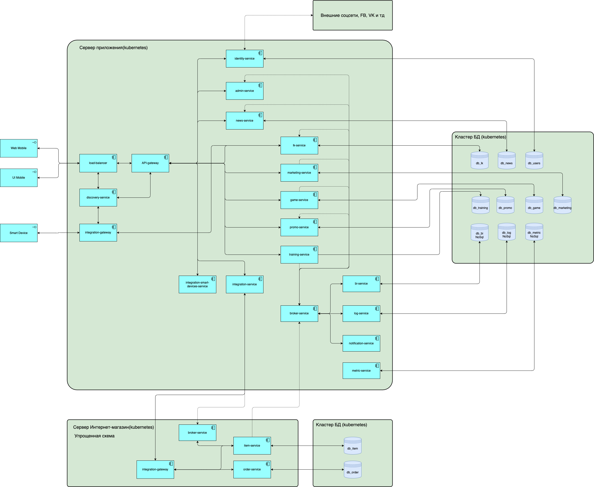

# Базовая архитектура

Представлены основные части архитектурного решения
- Приложения реализован на основе микросервисов;
- БД выделены в отдельный кластер с настроенным расписанием бэкапов, согласно НФТ;
- Все упаковано в Docker и управляется Kubernetes;

- Схема Интернет-магазина упрощенная, так как она в данном контексте нам не интересна, но так же развернуто на отдельном сервере с помощью Kubernetes для удобной оркестрации.