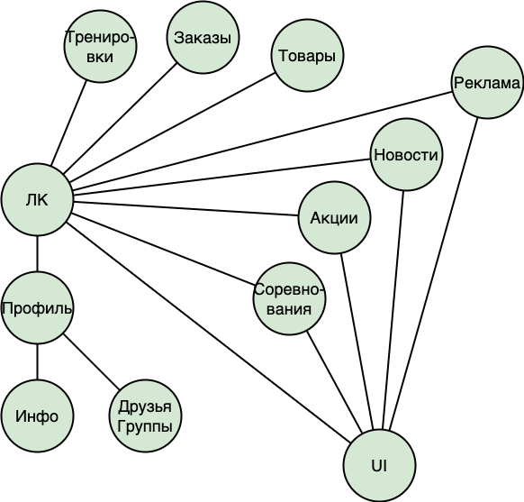

# Основные представления
* __a. Функциональное__

  
  На схеме показаны основные три слоя:
  - Слой UI;
  - Слой Бизнес-логики с сервисами и их основными функциями;
  - Слой хранения - кластер БД.

* __b. Информационное__ 

  

  - Без ЛК доступны только основные информационные блоки;
  - Из ЛК пользователю доступны основные блоки информации, а так же его профиль, заказы, и товары для быстрой покупки.

* __c. Многозадачность__
  

  На основе локаций пользователя можно развернуть экземпляры приложения так же в разных локациях, либо для дополнительных мощностей.

* __d. Инфраструктурное__
  

  Приложение развернуто в нескольких воркнодах в разных облачных серверах. Это позволит легко оркестрировать если откажет одна из нод.
  
  Здесь же, на второй машине, развернут Интернет-магазин(не показан на схеме)

* __e. Безопасность__

  За безопасность отвечает API Gateway, а так же интеграционный шлюз nginx, представленные на [базовой схеме](./13_Базовая%20архитектура.md "Базовая архитектура")
  * Фильтрация запросов;
  * Проверка ролей пользователей;
  * Реализация Circuit Breaker и Rate Limiter;
  * Контроль локации пользователей.
