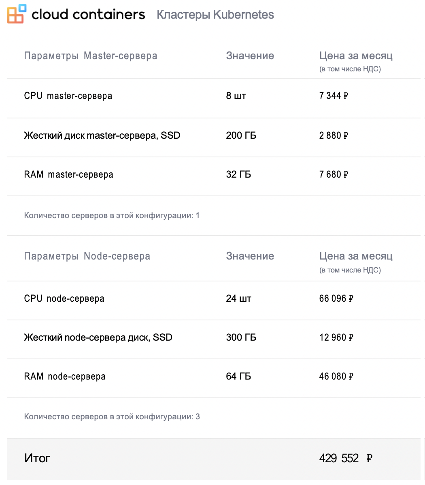
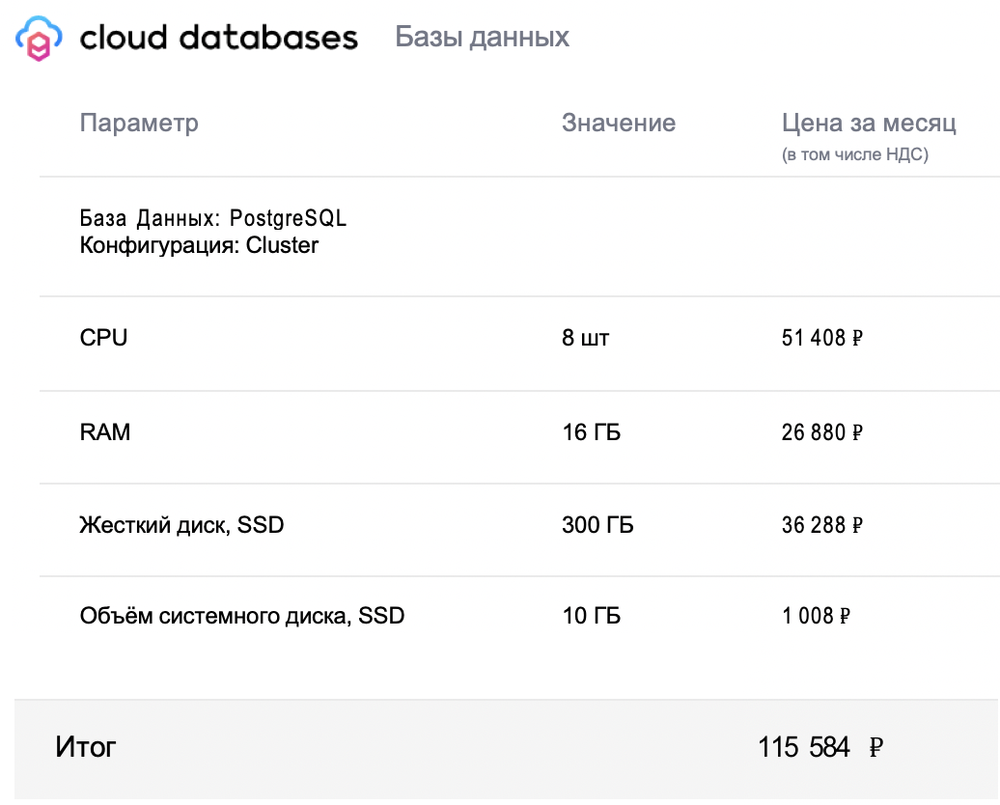
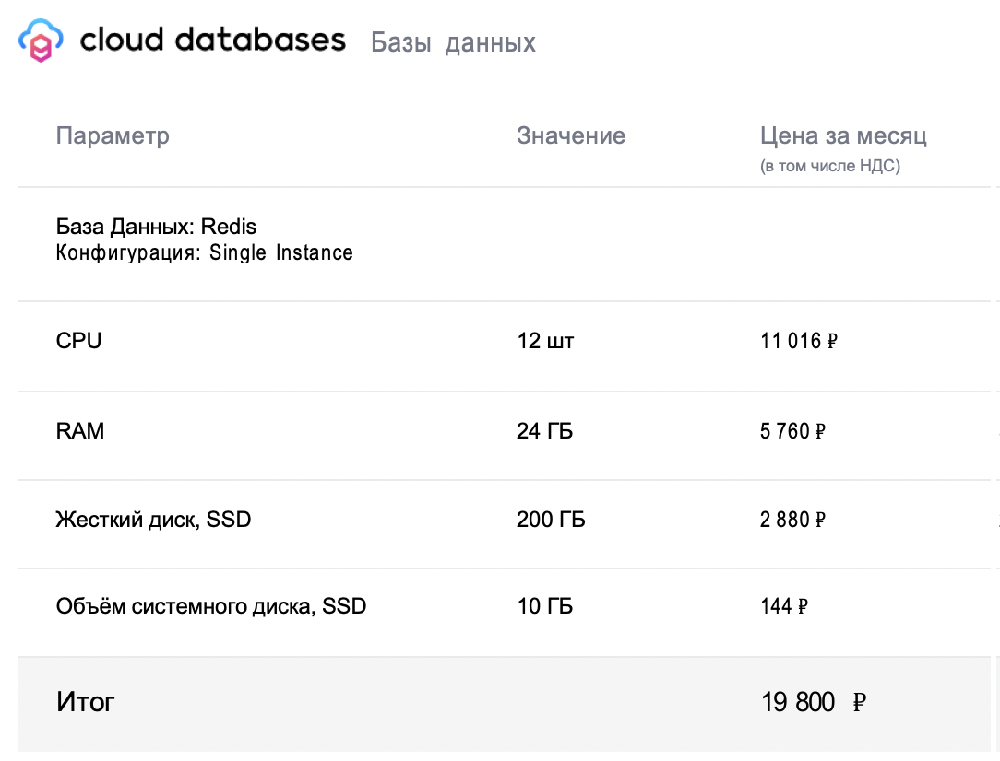
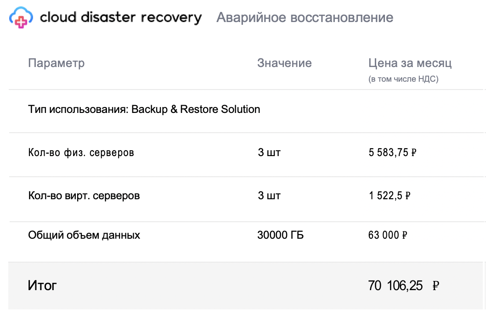
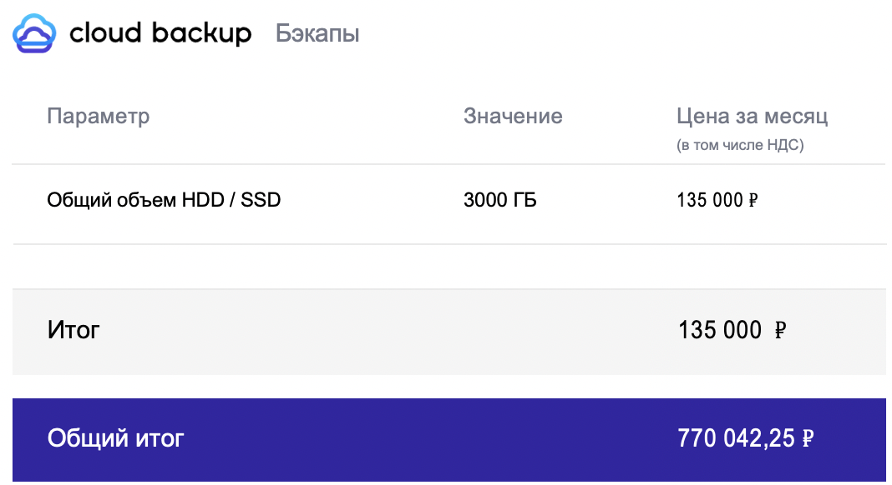

# Стоимость владения системой

Сайзинг для инфраструктуры приложения

|                      | Кол-во серверов, шт     | CPU, шт     | RAM, гб    | SSD, гб     |
|----------------------|-------------------------|-------------|------------|-------------|
| master-node          | 3                       | 8           | 32         | 200         |
| work-node            | 6                       | 24          | 64         | 300         |
| *Итого Kubernetes*   |                         | 168         | 480        | 2400        |
| -------------------- | ----------------------- | ----------- | ---------- | ----------- |
| db-server(postgres)  | 1                       | 8           | 18         | 300         |
| db-server(redis)     | 1                       | 12          | 24         | 200         |
| *Итого DB*           |                         | 20          | 42         | 500         |
| **Итого**            |                         | 188         | 524        | 2900        |
| -------------------- | ----------------------- | ----------- | ---------- | ----------- |
| backup-server        | 1                       |             |            | 3000        |

### На основе сайзинга, запрашиваем стоимость инфраструктуры у популярного провайдера облачных систем

## Итого
|       | Месяц, руб | Год, руб  | Два года, руб | Пять лет, руб |
|-------|------------|-----------|---------------|---------------|
| Итого | 770 000    | 9 240 000 | 11 088 000    | 14 400 000    |

- Согласно рекомендациям, каждые 2 года необходимо прибавлять 20% к стоимости, именно столько закладывают на увеличение мощностей, нужное для роста проекта.

### В текущей оценки учтены только Первоначальные затраты

